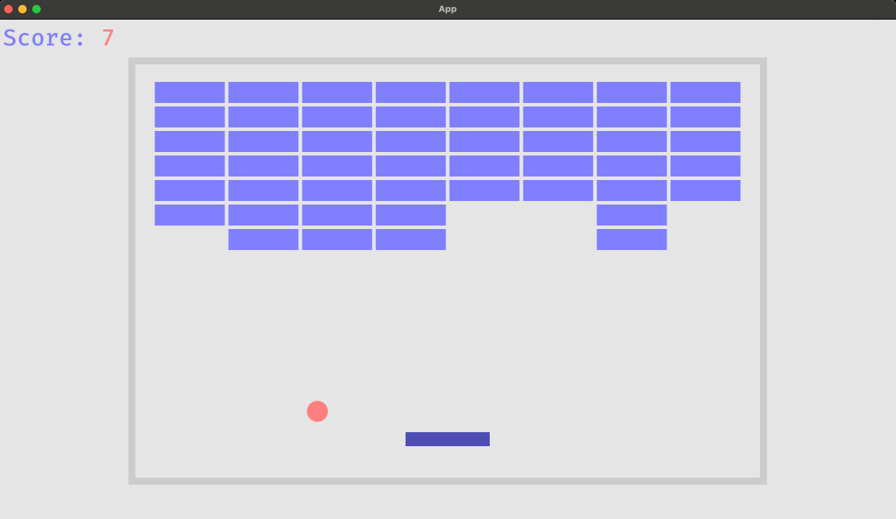

# Bevy Breakout Refactored

[](breakout.png)

[Bevy](https://github.com/bevyengine/bevy/tree/latest) is a game engine built in rust.

Bevy included an example project for the classic game of breakout [here](https://github.com/bevyengine/bevy/blob/88599d7fa06dff6bba434f3a91b57bf8f483f158/examples/games/breakout.rs).

Bevy Breakout Refactored is an attempt to refactor the aforementioned implementation of breakout so that it is more readable/maintainable. It is also practice for me as I am comletely new to rust. This "refactor" should be taken with a grain (or two) of salt.

### Building and Running

1. Install [rust](https://www.rust-lang.org/tools/install).
2. Clone this repo.
3. Run the following
```
cd bevy-breakout-refactored
cargo build
cargo run
```
### Notes

- [automod](https://crates.io/crates/automod) is used in `mod.rs` module directories to generate `mod <module_name>` for all files contained within those directories.
  - Typically, these `mod` are private. There is an implementation of a macro in this project called `autouse` which is used to create `pub use self::<module_name>::*;` in the `mod.rs` files as well. This makes importing these modules much cleaner (in my opinion).
- I wasn't able to build bevy on rust nightly. I used the stable release. I'm on Apple Silicon so my build target is `aarch64-apple-darwin`.
  - If you get this to build on nightly be sure to enable the rust flag `-Zshare-generics=y` in `.cargo/config.toml`.
